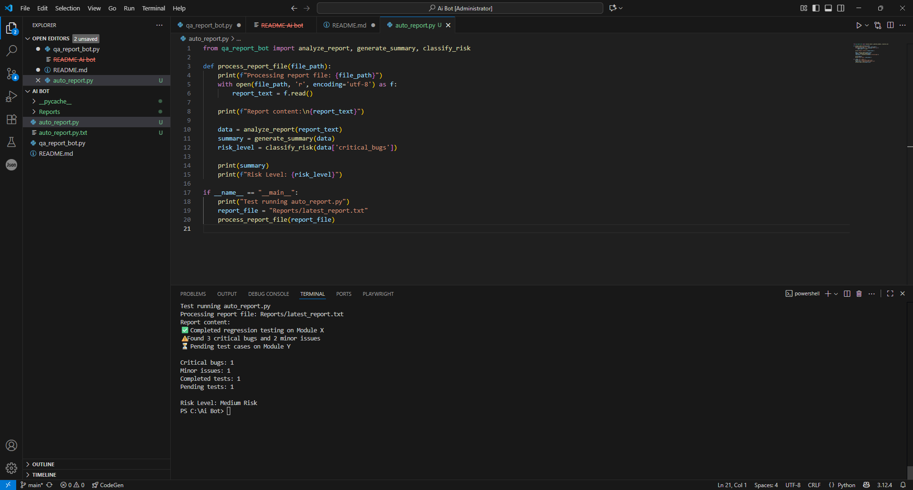

# AI QA Report Bot

## Overview

AI QA Report Bot is a simple Python-based tool that analyzes QA reports and classifies the overall bug risk level.

The project demonstrates how AI-inspired logic and automation can support QA teams by quickly extracting key testing information from plain text reports.

## Problem

QA reports often contain important information such as completed tests, pending tasks, critical bugs, and minor issues.  
When this information is reviewed manually, it can take time and may be inconsistent across reports.

## Solution

This bot reads a QA report, extracts key metrics, summarizes the results, and classifies the risk level based on the number of critical bugs found.

## Features

- Counts critical bugs
- Counts minor issues
- Detects completed tests
- Detects pending tests
- Generates a short QA summary
- Classifies overall risk level

## Technologies Used

- Python
- Text processing
- Conditional logic
- QA reporting
- Risk classification

## Example Output

```text
Completed regression testing on Module X.
Found 3 critical bugs and 2 minor issues.
Pending test cases on Module Y.

Risk Level: Medium Risk

## Project Goal

The goal of this project is to show how simple automation can improve QA reporting by making report analysis faster, clearer, and more consistent.

## Screenshot



## What I Learned

- How to structure a simple Python automation project
- How to extract information from QA reports
- How to apply basic risk classification logic
- How AI-inspired workflows can support software testing processes
